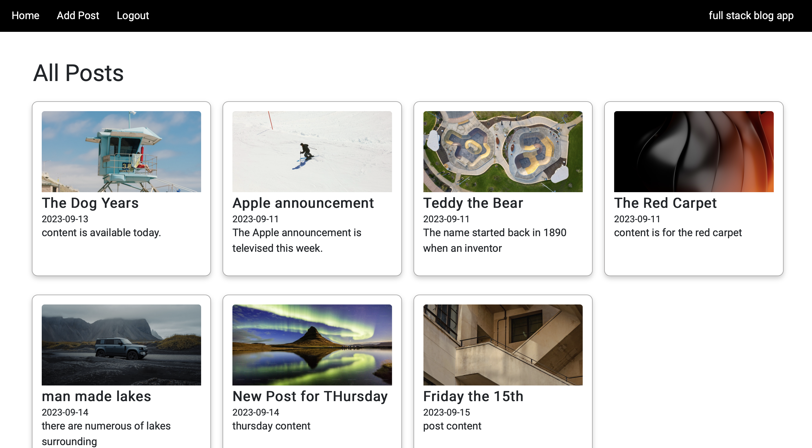

# Full-Stack Blog Application

## Description

The Full-Stack Blog Application is a web-based platform that allows users to create, read, update, and delete blog posts. The application is built using JavaScript, utilizing React for the frontend and Node.js with Express for the backend.

## Key Features: MVP (Minimal Valuable Product)

- **Create:** Users can create blog posts with titles, content, and dates.
- **Read:** Visitors can browse published blogs and read their content.
- **Update:** Users can edit and update their blog posts.
- **Delete:** Users can delete blog posts.
- **User Authentication:** Authenticated users can create new blog posts. The application supports user registration and login functionality for secure access to blog features.

### Frontend

- React: Used to create a dynamic and responsive user interface.
- React Router: Handles client-side routing for smooth navigation within the application.

### Backend

- Node.js: Serves as the backend runtime environment.
- Express.js: The web application framework for handling routes and API endpoints.
- MongoDB: Stores blog posts and user data.
- Postman: An object modeling tool for interacting with the MongoDB database.

### Styling

- CSS: Used for styling.
- CSS framework -  Bootstrap for an aesthetically pleasing and consistent user interface.

## Deployment

The application will be deployed on a cloud platform like Google Cloud Run, ensuring easy access for users without local installation.

## Purpose

By creating this Full-Stack Blog Application, we aim to provide a user-friendly and feature-rich platform for bloggers to share their thoughts and ideas with a wider audience. The combination of React and Node Express enables seamless data flow and ensures a high-performance blogging experience.

## Snapshots

## Add a new User Account

## Log In 

## Home Page

## Add New Post

## See Single Post

## Update Post

## Link to live Full Stack Blog App
[click here] (https://mern-blog-app-jan.web.app/)
